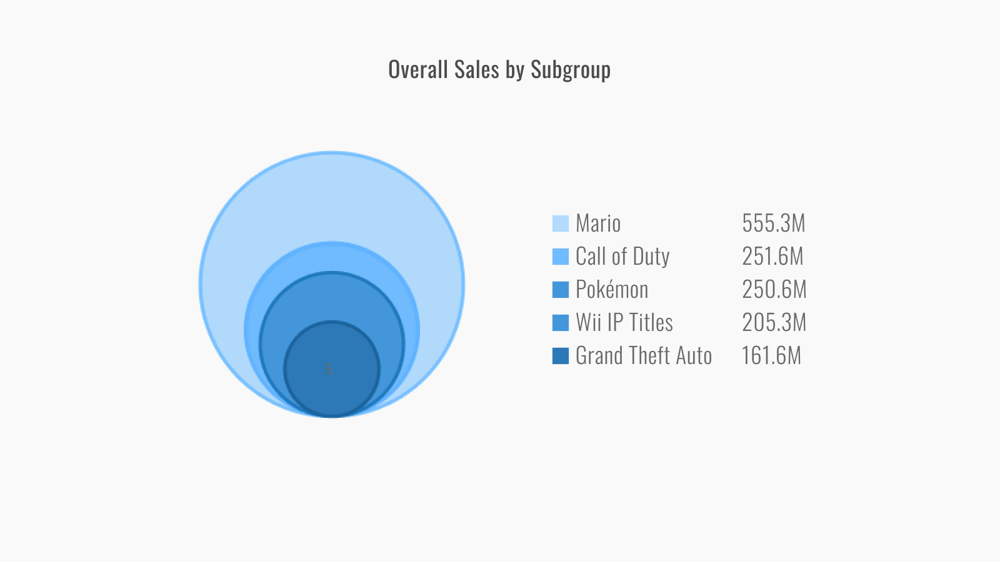
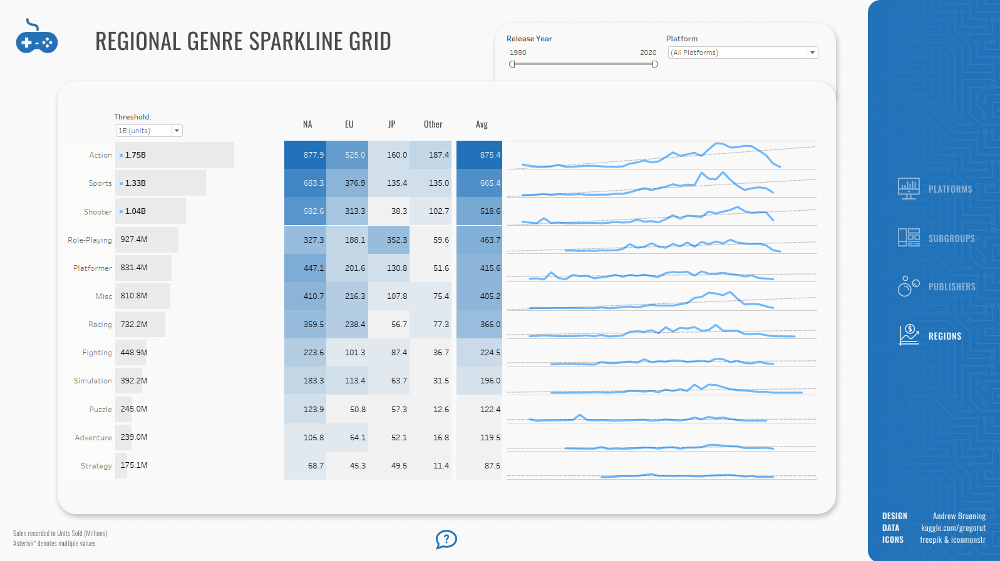
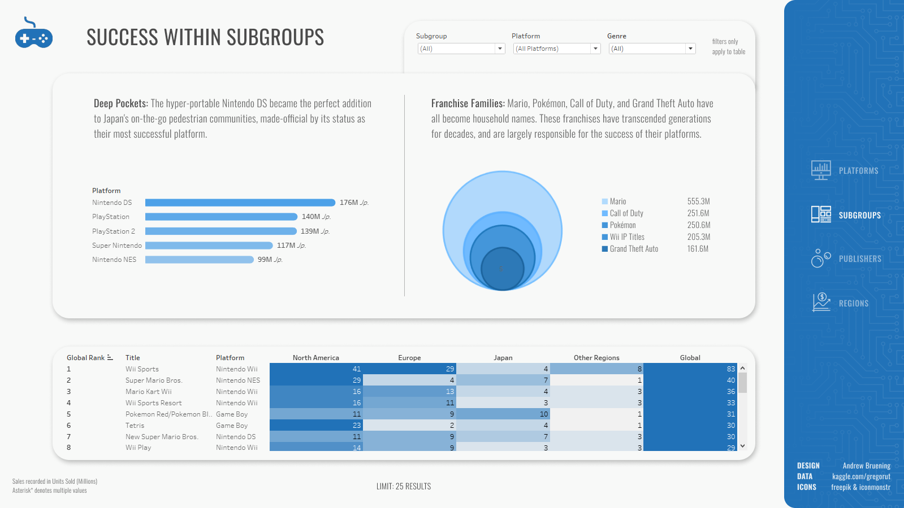

# Top-Global-Video-Game-Sales

### Hey! I'm Andrew. Welcome to my [Github] 👋

- 📊 Data visualization is my forte. See my [Tableau] page! 
- 🚀 Most of what you see here is Tableau, Python, and Figma
- 🧠 I'm interested in how our social climate and media trends influence marketing needs
- ⛳ A nice quote: "If it's worth doing, it's worth doing well"

## The Top 1000 Most Successful Video Game Titles by Year, Platform, Publisher, Genre, and Region.

This readme includes various screenshots, but you can view the actual dashboard [here].

## Approach
1. Python was used to clean two datasets ('steam' and 'games') which both contained various measures of video game data. There were many inconsistencies in game titles which could not have been cleaned without heavily relying on regex. Lambda functions were preferred.
2. Throughout the cleaning process, a few original functions were written and used repeatedly to monitor the effectiveness of NaN removal strategies.
3. Once the original data was cleaned, it was then merged via a right join from 'games' to 'steam.' The new 'biggames' dataframe was passed through a .melt function to restructure it  for use in Tableau.
4. The dashboard's background/style was designed in Figma then built in Tableau.

## Dashboard Highlights

**The Platform/Genre Bar Graph** 

- This graph was achieved with a combined field (platform & genre) bar graph on a dual axis with a shapes graph (the controller icons)
- Each shade of blue details a different genre within each platform, ordered by # of sales. 
- Tooltips can be accessed by hovering. Controller icons display similar platform stats (excluding genres)
- Parameters can then be used to filter the data by Release Year or Region. Nearly every graph and table in the dashboard can be filtered by these parameters.

**Overlapping Circle Graph** 

- Graphs like this can be made in Tableau with an intricate tweaking of calculated fields. For example, here's a window into my columns and rows pills for this visual.
 
    Columns: SIN([Index -1]*PI()/180)*[TC Value]
     
    Rows: COS([Index -1]*PI()/180)*([TC Value])+([TC Value])
     
- While there are many things that Tableau *can* be used for, some things are better off created in another program like Figma. The overlapping circle graph is one of those things. Building it in Tableau was less than intuitive, but it's important to note that the circles **are** proportional to each subgroup's sales totals.
- In conclusion, tackling juxtaposition with this type of visualization turned out to be a great choice. I'm very satisfied with the result.

**Publisher Bubble Chart**

The dashboard displays a scatter plot of k-means clusters at the level of Customer-ID. K-means aside, we've also used a segmentation model to categorize our customers into various "loyalty" segments.

**High-Spend Corporate Tech**

## Data Insights

**High-Spend Corporate Tech**

Initially, it was assumed that many High-Spend customers were one-off bargain-shoppers. 
After reviewing our data, we arrived at a different conclusion. 

- **Wii Sports** earned its place as the #1 best-selling title. While other platforms focused efforts on online, multiplayer, multiplatform franchises, Nintendo doubled down on local multiplayer with its groundbreaking motion-activated IPs. *(see Platforms)*

- **Deep Pockets:** The hyper-portable Nintendo DS became the perfect addition to Japan's on-the-go pedestrian communities, made-official by its status as their most successful platform. *(see Subgroups)*

- **Franchise Families:** Mario, Pokémon, Call of Duty, and Grand Theft Auto have all become household names. These franchises have transcended generations for decades, and are largely responsible for the success of their platforms.*(see Subgroups)*

- **Publisher Priorities:** The top 3 publishers (Nintendo, EA, Activition) dominated the markets for their own respective genres (Platformer, Sports, Shooter). Each of these genres became each publisher's #1 genre by a longshot. *(see Publishers)*

These graphs aim to give perspective to the varying loyalty groups as we compare and contrast them. Similar to RFM scores, clusters are graded on an increasing scale from 1-4..

- Silver and Gold are the most influential groups with regards to total profit. Platinum and High-Spend are the most valuable per customer.

- K-means clustering displays the variance within groups and where they overlap. 

- Parts of High-Spend, Silver and Churn Risk all belong to Cluster 3 (hover to see tooltip) - our model interprets each group to be statistically similar to a certain degree. With proper targeting, Silver is a group we'd aim to grow and maintain. A future comparison will ideally show the "fringe" customers of High-Spend and Churn Risk to have ultimately moved into the Silver group. 

**Distribution Comparisons**

The ternary graph illustrates customer representation per RFM score.
Switch the graph to off to view the distribution as a matrix.

- The dropdown menu above the ternary graph filters results by loyalty groups. The High and Low options reflect the tiers of each group and correspond to a column value in the RFM Scoring Key.

- Color saturation in the RFM matrix is directly correlated to monetary (M) values of each cell. While the lowest RFM scores (111) reflect low monetary values, Churning still represents 10% of our customers.

**YoY Comparison**

In November and December of 2018, Churning customers were responsible for a total of $0.00 in sales.

- This is a sign that we need to conduct our customer retention efforts differently - especially during the holiday season. 2017 performance during these same months was much higher, mostly due to Consumer Furniture purchases.

**B2C Prioritization**

The spreadsheet below elaborates on specific values per Customer ID.
The size table illustrates categories and segments by proportion of sales.

- A large portion of Gold and Silver sales are derived from Consumer products of all segments. Home Office products are consistently the least successful products across the board.

- We previously touched on the success of Corporate and Consumer Technology with High-Spend customers. While a new emphasis on B2B may seem enticing, Corporate Technology sales do not account for a large enough portion of our total sales in order for us to pivot our strategy in that direction. Consumer products should still remain our primary focus.

## See the complete interactive dashboard [here]

### Main takeaways from this project thus far:

1. Both 'games' and 'steam' were adequately-sized datasets
2. 'games' was over twice the size of 'steam', but had much less integrity (NaN %, Title formatting)
3. 'games' proved to be very inconsistent - only 36 NaNs in one column, over 37000 NaNs in another column

Personal thoughts:

1. 'steam' was pleasant to work with, and was prioritized for its sales data
2. To avoid disturbing the accuracy of global rankings, I decided against dropping biggames titles with NaN Publisher values
2. To allow for more creativity/flexibility, I hope to work with larger, more consistent datasets in the future
3. Looking forward to plotting this out in Tableau!

[Tableau]: https://public.tableau.com/app/profile/andrew.bruening
[Github]: https://github.com/andrewbruening
[here]: https://public.tableau.com/app/profile/andrew.bruening/viz/TopGlobalVideoGameSales/DBPlatforms